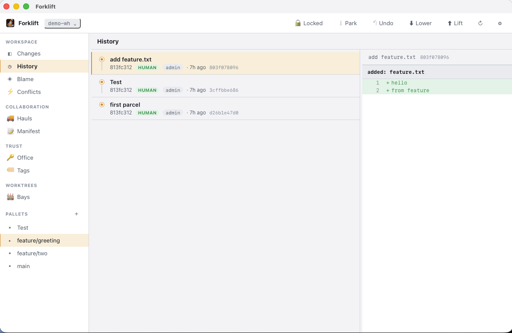

# Forklift GUI

A desktop GUI for the [Forklift](https://github.com/lonic-software/forklift) VCS — built with
[Tauri](https://tauri.app) (Rust) + React + TypeScript.



It is a **thin, decoupled** front end: it never links `forklift-core` or touches the on-disk
format. It drives the `forklift` CLI through its stable, versioned machine interface
(`forklift … --json`). That contract — one JSON envelope per command, stable `error.code`s,
deterministic exit codes — is the *only* thing this app couples to, so it keeps working across
Forklift's internal changes.

## Install

**With [pult](https://github.com/lonic-software/pult)** — an npx-style launcher for a repo's
operational commands. One command fetches the installer, drops the app in place, and exposes a
`forklift-gui` launcher on your PATH:

```sh
pult x github.com/r4nd0mth1ngs/forklift_ui install
```

**Without pult** — a one-liner that does the same thing:

```sh
# macOS / Linux — installs the app and a `forklift-gui` launcher
curl -fsSL https://raw.githubusercontent.com/r4nd0mth1ngs/forklift_ui/main/install.sh | sh
```

```powershell
# Windows (PowerShell) — runs the setup (per-user, no admin) and adds it to your PATH
irm https://raw.githubusercontent.com/r4nd0mth1ngs/forklift_ui/main/install.ps1 | iex
```

What it installs per OS:

| OS | App | `forklift-gui` command |
|----|-----|------------------------|
| macOS | `forklift-gui.app` → `/Applications` (or `~/Applications`) | shim in `~/.local/bin` that runs `open -a` on it |
| Linux | the portable `.AppImage` → `~/.local/bin/forklift-gui` (+ a `.desktop` menu entry) | the AppImage itself |
| Windows | the NSIS setup → `%LOCALAPPDATA%\forklift-gui` (+ Start Menu shortcut) | the install dir, added to your user PATH |

Pin a version or point at a mirror with the `FORKLIFT_GUI_VERSION`, `FORKLIFT_GUI_INSTALL_DIR`,
`FORKLIFT_GUI_APP_DIR`, `FORKLIFT_GUI_REPO`, or `FORKLIFT_GUI_BASE_URL` environment variables (see
the header comments in `install.sh` / `install.ps1`). Or grab a build by hand from Releases:

## Download

Grab the latest build from **[Releases](https://github.com/r4nd0mth1ngs/forklift_ui/releases/latest)**:

| Platform | File |
|----------|------|
| macOS (Apple Silicon + Intel) | `…_universal.dmg` |
| Linux (portable) | `…_amd64.AppImage` |
| Linux (Debian/Ubuntu) | `…_amd64.deb` |
| Linux (Fedora/RHEL) | `…-1.x86_64.rpm` |
| Windows (installer) | `…_x64_en-US.msi` |
| Windows (setup) | `…_x64-setup.exe` |

macOS builds are unsigned (first launch: **right-click → Open**); Windows may show a SmartScreen prompt (**More info → Run anyway**).

You also need a `forklift` binary — the app **auto-detects** it, or **installs it for you**
(the welcome screen and *Settings → Binary* have an **Install forklift** button that runs the
Forklift repo's installer). You can also point it at a specific binary in *Settings → Binary*.

## How it works

```
┌──────────────┐   invoke    ┌─────────────────┐   spawn + --json   ┌────────────┐
│  React UI    │ ─────────▶  │  Rust backend   │ ─────────────────▶ │  forklift  │
│  (src/)      │ ◀───────── │  (src-tauri/)    │ ◀───────────────── │  CLI binary│
└──────────────┘  typed JSON └─────────────────┘   envelope / text   └────────────┘
```

The Rust backend (`src-tauri/src/forklift.rs`) exposes a handful of primitives:

- `detect_binary` / `install_forklift` — locate (or install) the `forklift` binary.
- `run_json(warehouse, args)` — run a subcommand with `--json`, return its `data` payload, or an
  `Err` carrying the stable `{ code, message, next_step }` on failure. It extracts the trailing
  JSON envelope, so commands that print progress first (self-update) still parse.
- `run_text(warehouse, args)` — run in human mode and strip ANSI (used for the line-level diff,
  which Forklift only renders as prose).

Every command-specific type and argument list lives in the TypeScript layer (`src/api.ts`), next
to the UI that uses it. Adding a Forklift command to the GUI is usually a one-line addition there.

### Binary resolution

An explicit override (*Settings → Binary*) or `FORKLIFT_BIN` always wins. Otherwise the backend
probes every known location — a sibling `../forklift/target/release` dev build, `~/.local/bin`,
`~/.cargo/bin`, Homebrew, and `PATH` — and uses the **newest** version found. So after a
`self-update` (or the in-app installer) drops a newer binary, the GUI points at it automatically.

## Features

| Area | Forklift commands | Notes |
|------|-------------------|-------|
| **Changes** | `stocktake`, `load`, `unload`, `restore`, `stack`, `diff` | Stage/unstage, discard, inline line-level diff, commit box (⌘↵), parked (stash) list |
| **History** | `history` + `office` | Parcel log with a graph rail and a per-parcel diff; identity badges (human / agent / bot / service) joined from the office; cherry-pick |
| **Blame** | `blame` | Signed line attribution; browse-and-pick any file |
| **Conflicts** | `conflicts`, `peek` | The three content-addressed sides of each conflict |
| **Pallets** | `palletize`, `shift`, `consolidate`, `deliver` | Branch list, switch, create; per-pallet merge / deliver |
| **Remote** | `lift`, `lower`, `franchise` | Push / pull; clone from a URL |
| **Office** | `office` (all 11 subcommands), `audit` | Signed identities, roles, keys; enroll / admit / rotate / retire / …; offline audit |
| **Tags** | `tag` (create / show / list) | Signed release tags |
| **Hauls** | `haul` (all 8 subcommands) | Pull requests: open, discuss, signed review, merge / close |
| **Manifest** | `manifest` (note / approve / provenance / show) | Signed post-metadata incl. AI provenance |
| **Bays** | `bay` (add / remove / list) | Worktrees |
| **Top bar** | `park`, `undo`, `lift`, `lower` | Stash, undo, push, pull |
| **Settings** | `config`, `profile`, `import-git`, `export-git`, `store`, `compact`, `peek`, `self-update` | Config editor, profiles, git interop, **object-store health + compaction bar**, object inspect, updates with version cards |

**Signing without a terminal** — office/tag/manifest/haul operations sign, but a GUI has no TTY.
A top-bar **🔒 lock** sets an in-memory passphrase, passed to forklift as
`FORKLIFT_KEY_PASSPHRASE`, so passphrase-protected keys work.

### Terminology (aliases)

The whole UI speaks a vocabulary you choose in *Settings → Terminology* — a built-in preset or
your own custom aliases:

- **Forklift** (native) — Warehouse, Parcel, Pallet, Stack, Consolidate, Lift/Lower…
- **Git** (familiar) — Repository, Commit, Branch, Commit, Merge, Push/Pull…
- **Meló** — Hungarian workshop slang.
- **Brainrot** 💀🔥 — Repoverse, Canon Event, Aura Line, Lock In, Send It, Vibe Check…
- **Custom** — override any term.

### Resizable panes

Drag the divider between the sidebar and content, and between the list and detail in every
master-detail panel. Double-click a divider to reset; widths persist.

## Develop

Prerequisites: [Rust](https://rustup.rs), Node + [pnpm](https://pnpm.io), and a `forklift` binary
(or install one from the app).

```sh
pnpm install
pnpm tauri dev      # run the app with hot reload
pnpm tauri build    # produce a distributable bundle
pnpm build          # typecheck + build the frontend only
```

These are also wired into [pult](https://github.com/lonic-software/pult): run `pult` in the repo
for a guided menu (`dev` / `build` / `install`), or `pult <id>` directly. See `pult.yaml`.

Backend tests exercise the real `forklift` binary end-to-end:

```sh
cd src-tauri && cargo test
```

## Releases

Tagging `vX.Y.Z` triggers `.github/workflows/release.yml`, which builds macOS (universal), Linux,
and Windows on GitHub runners and publishes a GitHub Release with all artifacts. To cut one: bump
the version in `src-tauri/tauri.conf.json` (and `package.json` / `src-tauri/Cargo.toml`), then:

```sh
git tag v0.1.2 && git push origin v0.1.2
```

## License

MIT OR Apache-2.0, matching Forklift.
